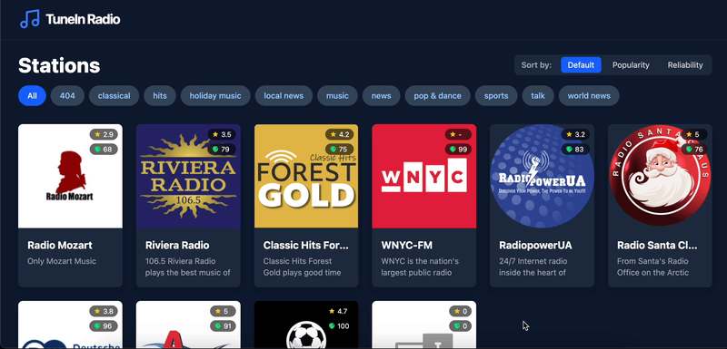

[](https://github.com/matik12/tunein-app/actions/workflows/main.yml)

# What's TuneIn App?

- A single-page React application for streaming radio stations with a custom audio player and modern UI based on [vite](https://vitejs.dev) skeleton using Typescript and Tailwind (monorepo includes few productivity improvements).
- App displays available stations with filtering/sorting options and provides station playback functionality.
- App uses sample S3 based Station API to fetch stations.
- App relies on custom, flexible and extensible audio player implementation built in a separate library package [@tunein/audio-player](./packages/audio-player/README.md)

Live app demo can be found [here](https://matik12.github.io/tunein-app/)



## Core Features

- Custom Player UI with play/pause controls, and station info display
- Persistent Player Bar - appears at bottom of screen once a station is loaded
- Global State Management - player state persists across navigation
- Visual Feedback - loading animations and playing indicators
- Non-interrupting Playback - navigating to new stations doesn't stop current playback

**Important Notes**: This web app is just a proof of concept, and there are crucial implementation parts missing that are usually required for production readiness such as test coverage on different level (Testing Trophy), advanced playback implementation (browsers autoplay policies, cors considerations, network resilience etc), error reporting, playback metrics (quality, performance), product analytics, translations (potentially) etc.

## What's inside?

This monorepo includes the following packages and apps:

### Apps and Packages

- `web`: react [vite](https://vitejs.dev) ts app
- `@tunein/audio-player`: is a component library used by `@tunein/audio-player-react` package
- `@tunein/audio-player-react`: is a component library with [Tailwind CSS](https://tailwindcss.com/) used by `web` application
- `@tunein/eslint-config`: shared `eslint` configurations
- `@tunein/tailwind-config`: shared `tailwindcss` configurations
- `@tunein/typescript-config`: `tsconfig.json`s used throughout the monorepo

Each package and app is 100% [TypeScript](https://www.typescriptlang.org/).

### Building packages/audio-player-react

This example is set up to produce compiled styles for `audio-player-react` components into the `dist` directory. The component `.tsx` files are consumed by the Vite apps directly. This was chosen for several reasons:

- Make sharing one `tailwind.config.ts` to apps and packages as easy as possible.
- Make package compilation simple by only depending on the Vite Compiler and `tailwindcss`.
- Ensure Tailwind classes do not overwrite each other. The `audio-player-react` package can use a `audioplayer-` prefix for it's classes if needed.
- Maintain clear package export boundaries.

Another option is to consume `packages/audio-player-react` directly from source without building. If using this option, you will need to update the `tailwind.config.ts` in your apps to be aware of your package locations, so it can find all usages of the `tailwindcss` class names for CSS compilation.

For example, in [tailwind.config.ts](packages/tailwind-config/tailwind.config.ts):

```js
  content: [
    // app content
    `src/**/*.{js,ts,jsx,tsx}`,
    // include packages if not transpiling
    "../../packages/audio-player-react/*.{js,ts,jsx,tsx}",
  ],
```

If you choose this strategy, you can remove the `tailwindcss` and `autoprefixer` dependencies from the `audio-player-react` package.

### Utilities

This Turborepo has some additional tools already setup for you:

- [Tailwind CSS](https://tailwindcss.com/) for styles
- [TypeScript](https://www.typescriptlang.org/) for static type checking
- [ESLint](https://eslint.org/) for code linting
- [Prettier](https://prettier.io) for code formatting
